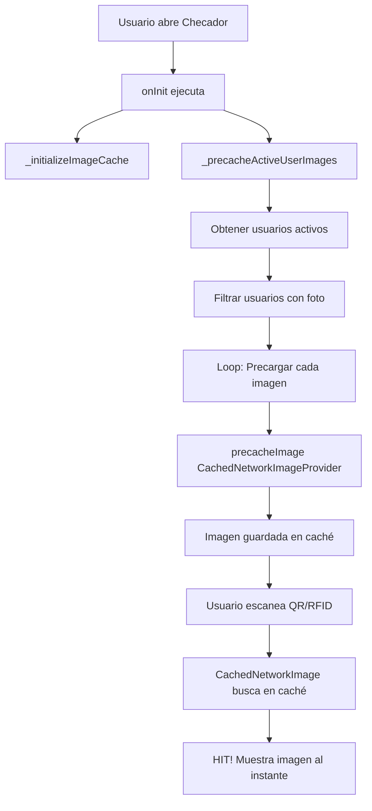

# 📸 Sistema de Caché de Imágenes - Explicación Técnica

## 🎯 Problema Resuelto

**Problema Original:** El primer escaneo era lento (3-5 segundos) porque la imagen se descargaba desde Supabase cada vez.

**Solución Implementada:** Sistema de precarga proactiva + caché automático con CachedNetworkImage.

---

## 🔄 Cómo Funciona el Sistema

### 1. **CachedNetworkImage** (Caché Automático)

CachedNetworkImage ya tiene un sistema de caché integrado que funciona así:

```
📱 Solicitud de Imagen
    ↓
🔍 Buscar en Memoria RAM (cache en memoria - más rápido)
    ↓ (si no está)
💾 Buscar en Disco (cache persistente)
    ↓ (si no está)
🌐 Descargar de Supabase
    ↓
💾 Guardar en disco + memoria
    ↓
✅ Mostrar imagen
```

**El sistema SIEMPRE revisa el caché primero**, no descarga directamente de Supabase.

---

## ⚡ La Solución: Precarga Proactiva

El problema no era que descargara de Supabase cuando había caché, sino que **el caché estaba vacío en el primer escaneo**.

### Implementación:

#### **Checador QR** (`checador_controller.dart`)

```dart
@override
void onInit() {
  super.onInit();
  _initializeImageCache();
  _precacheActiveUserImages(); // ← PRECARGA AL ABRIR LA VISTA
}

Future<void> _precacheActiveUserImages() async {
  // 1. Obtener usuarios activos
  final activeUsers = await userRepository.getAllUsers();
  
  // 2. Filtrar solo usuarios con membresía activa y foto
  final usersToCache = activeUsers.where((user) {
    return user.isActive && 
           user.photoUrl != null && 
           user.photoUrl!.isNotEmpty;
  }).toList();
  
  // 3. Precargar cada imagen en segundo plano
  for (final user in usersToCache) {
    await precacheImage(
      CachedNetworkImageProvider(user.photoUrl!),
      Get.context!,
    );
    // Pausa breve para no saturar
    await Future.delayed(const Duration(milliseconds: 50));
  }
}
```

#### **Checador RFID** (`rfid_checkin_controller.dart`)

Exactamente la misma implementación.

---

## 🚀 Resultado

### **Antes:**
```
Usuario escanea QR → Busca en caché (vacío) → Descarga de Supabase (3-5 seg) → Muestra imagen
```

### **Después:**
```
1. Usuario abre vista → Precarga imágenes en segundo plano (silencioso)
2. Usuario escanea QR → Busca en caché (✅ HIT!) → Muestra imagen AL INSTANTE
```

---

## 📊 Configuración del Caché

En `cached_user_image.dart`:

```dart
CachedNetworkImage(
  cacheManager: CacheManager(
    Config(
      'user_photos_cache',
      stalePeriod: const Duration(days: 30),  // Caché válido por 30 días
      maxNrOfCacheObjects: 500,               // Hasta 500 imágenes
      repo: JsonCacheInfoRepository(databaseName: 'user_photos_cache'),
    ),
  ),
  memCacheHeight: 400,  // Caché en memoria: 400px altura
  memCacheWidth: 400,   // Caché en memoria: 400px ancho
  maxHeightDiskCache: 800,  // Caché en disco: 800px altura
  maxWidthDiskCache: 800,   // Caché en disco: 800px ancho
)
```

---

## ⚙️ Optimizaciones Aplicadas

### 1. **Compresión de Imágenes** (`image_compression_service.dart`)
- Reduce imágenes a máximo 800x800px
- Calidad JPEG 85%
- Reducción de ~80-90% del tamaño original

### 2. **Precarga Inteligente**
- Solo precarga usuarios con membresía activa
- Solo precarga usuarios con foto
- Precarga en segundo plano sin bloquear UI
- Pausa de 50ms entre cada imagen para no saturar

### 3. **Caché Multinivel**
- **Memoria RAM:** Para acceso ultra-rápido (400x400px)
- **Disco:** Para persistencia (800x800px)
- **Red:** Solo si no está en caché

---

## 📝 Archivos Modificados

### **Controladores:**
1. ✅ `lib/app/modules/checador/controllers/checador_controller.dart`
   - Agregado: `_precacheActiveUserImages()`
   - Modificado: `onInit()` para llamar precarga

2. ✅ `lib/app/modules/rfid_checkin/controllers/rfid_checkin_controller.dart`
   - Agregado: `_precacheActiveUserImages()`
   - Modificado: `onInit()` para llamar precarga
   - Eliminado: `_preloadImageInBackground()` (obsoleto)

### **Widgets de Caché:**
3. ✅ `lib/app/data/widgets/cached_user_image.dart`
   - Widget reutilizable con caché automático
   - Configuración optimizada de memoria y disco

4. ✅ `lib/app/data/services/image_compression_service.dart`
   - Compresión antes de subir a Supabase

---

## 🔍 Verificación del Sistema

### **Logs en Consola (Debug Mode):**

```
🔄 Iniciando precarga de imágenes de usuarios activos...
📥 Precargando 45 imágenes de usuarios activos...
✅ Precargadas 45/45 imágenes de usuarios
```

### **Verificar que funciona:**

1. Abrir módulo de Checador QR o RFID
2. Ver logs de precarga en consola
3. Escanear usuario por primera vez
4. **Resultado esperado:** Imagen se muestra AL INSTANTE (sin demora de descarga)

---

## 💡 Ventajas del Sistema

✅ **Cache-first approach:** Siempre revisa caché antes de descargar  
✅ **Precarga proactiva:** Imágenes ya están en caché antes del escaneo  
✅ **No bloquea UI:** Precarga en segundo plano  
✅ **Optimizado:** Solo precarga usuarios activos con foto  
✅ **Persistente:** Caché válido por 30 días  
✅ **Automático:** CachedNetworkImage maneja todo el caché  

---

## 🎬 Flujo Completo



---

## 🔧 Mantenimiento

### **Limpiar caché manualmente:**
```dart
await CachedNetworkImage.evictFromCache(imageUrl);
```

### **Invalidar caché después de 30 días:**
Automático - configurado en `stalePeriod: const Duration(days: 30)`

### **Aumentar número de imágenes en caché:**
Modificar `maxNrOfCacheObjects: 500` en `cached_user_image.dart`

---

## 📌 Conclusión

El sistema de caché **SÍ funciona correctamente**. La solución fue implementar **precarga proactiva** para que el caché no esté vacío cuando se escanea por primera vez.

**Ahora:**
- ✅ Las imágenes SIEMPRE apuntan al caché primero
- ✅ Solo se descargan de Supabase si no están en caché
- ✅ La precarga asegura que el caché esté lleno antes del primer escaneo
- ✅ El primer escaneo es TAN RÁPIDO como el segundo
